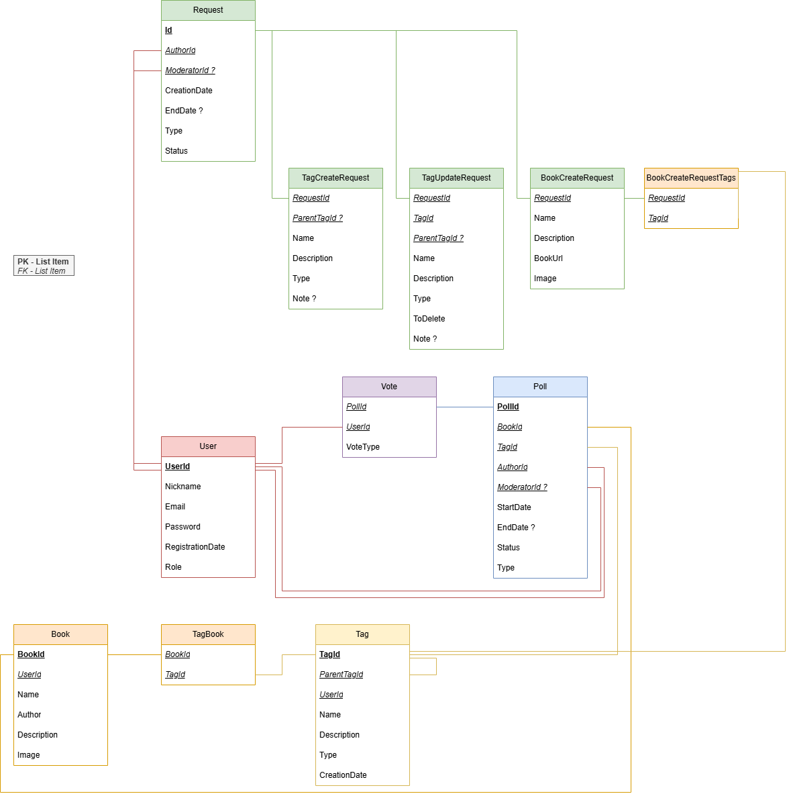

# Техническое задание (ТЗ)  (Версия от 03.03.2026)
## Проект «Alexandria»  

Центральный документ проекта, содержащий полное описание разрабатываемого продукта — веб-сервиса для каталогизации и тегирования книг.

---

## 1. Описание артефактов и терминов (Глоссарий)

- **Alexandria** — веб-приложение для систематизации и поиска книг по гибкой системе тегов, присваиваемых пользователями.  
- **Книга** — единица каталога, содержащая базовую информацию (название, автор, описание, обложка, ISBN) и набор связанных с ней тегов.  
- **Тег** — метка (ключевое слово), характеризующая содержание или атрибуты книги (например: «фантастика», «негативный главный герой», «химеролог», «авторские гномы»).  

**Типы тегов:**  
- Жанры  
- Авторы  
- Ориджинал/Фанфик  
- Тропы
- Язык  

У каждого тега может быть родительский тег.

**Тип голосования:**
- Голосовании за привязку
- Голосовании за отвязку

**Статусы голосования:**
- В процессе
- Принято
- Отклонено

**Действия с тегами:**  
- **Создание тега** — ввод нового, ранее не существовавшего тега; тег отправляется на **премодерацию**.  
- **Добавление тега (к книге)** — привязка существующего тега к книге; инициирует процесс **голосования**.  
- **Удаление тега (от книги)** — открепление тега от книги; инициирует **голосование**.  

**Процессы:**  
- **Премодерация** — проверка модераторами новых тегов на соответствие правилам сайта перед публикацией.  
- **Голосование** — оценка сообществом уместности привязки тега к книге; отображается на странице книги.

**Роли пользователей:**  
- **Неавторизованный** — просмотр каталога, книг и тегов.  
- **Авторизованный** — создание тегов, добавление/предложение удаления тегов, голосование, профиль со статистикой.  
- **Модератор** — премодерация тегов, объединение дублей, управление голосованиями, бан пользователей.  
- **Администратор** — управление ролями, правами, настройками и правилами сайта.  

---

## 2. Продуктовое описание (Как продукт выглядит для пользователя)

**Цель продукта:**  
Создать гибкий каталог книг, где теги придумывают читатели, а не авторы, что позволяет точнее отражать содержание и настроение произведений.  

**Основные сценарии использования:**  

### Поиск книг
- Пользователь ищет книги по названию/автору или фильтрует по тегам.  
- Пример: клик на тег «авторские гномы» — отображение всех книг с этим тегом.  

### Просмотр книги
- Страница книги содержит описание и облако тегов.  
- Отображается текущие голосования за теги.

### Создание нового тега
1. Пользователь понимает, что для книги не хватает тега (например, «химеролог»).  
2. Переходит в раздел создания тега и вводит название.  
3. Тег попадает в лист ожидания модератора, на этап премодерации. Пользователь получает уведомление о проверке в свой профиль (отображается количесвто непрочитанных уведомлений в панеле меню).  

### Модерация тега
- Модератор проверяет тег на соответствие правилам сайта.  
- При соответствии — публикует тег; при дублировании — объединяет или отклоняет.  

### Добавление тега к книге
1. На странице книги пользователь нажимает «Добавить тег».  
2. Вводит слово, система предлагает существующие варианты.  
3. Выбирает тег и добавляет его.  
4. Появляется кнопка или интерфейс для голосования «За/Против».  

### Логика голосования 

Если тег не привязан к книге, можно начать голосование за привязку.

Если тег привязан к книге, можно начать голосование за отвязку.

Голосование по привязке тега к книге или отвязке тега от книги длится **7 календарных дней** с момента создания.

Для принятия решения требуется **минимум 10 голосов**.

Голосование завершается принятием, если количество голосов «За» как минимум в два раза превышает количество голосов «Против». Голосование завершается отказом, если количество голосов «Против» как минимум в два раза превышает количество голосов «За».

Если по истечении 7 дней:
- не набрано 10 голосов;
- или условие перевеса не выполнено, то результат голосования передается модераторам.

*Пользователь имеет только 1 голос в каждом голосовании, но может менять или убирать свой голос*

### Объединение тегов

Модератор может выбрать 2 тега, которые надо объеденить и выбирает тег, который останется и тег, который удалится. Во всех связях с другим тегом удаляемый меняется на остающийся.

## 3. Техническое описание (Архитектура решения)

**Стек технологий:**
- **Backend:** ASP.NET Core (.NET 9)
- **Язык:** C#
- **База данных:** PostgreSQL 14+
- **Frontend:** Angular / HTML+CSS+TypeScript

**Модули системы:**  

### Модуль аутентификации и авторизации
- Регистрация/вход (email + пароль, хеширование паролей).  
- Управление сессиями (JWT).  
- Разграничение прав доступа на уровне middleware.  

### Модуль каталога книг
- CRUD для книг (доступен администраторам и модераторам).  
- Поиск по названию, автору, тегам.  
- Фильтрация книг по тегам.  

### Модуль управления тегами
- Создание тега — создание нового тега после успешного прохождения премодерации.
- Премодерация — принятие или отклонение нового тега.
- Получение списка тегов.

### Модуль голосования
- API для добавления/удаления тега книге.
- API для голосования за конкретную добавление/удаление связки книга-тег.  
- Фоновый процесс  для проверки результатов голосования и изменения статуса связи.  

### Модуль пользователей и уведомлений
- Профиль пользователя с историей действий (созданные теги, голосования).  
- Простая система уведомлений о результатах премодерации.
- Уведомления хранятся месяц. При прочтении не отображаются в меню. 

### Диаграмма БД

## 4. Условия эксплуатации (Требования к окружению)

**Клиентская часть:**  
- Веб-браузеры: последние версии Chrome, Yandex Browser.  

**Серверная часть:**
- ОС: Linux (Ubuntu 20.04+)  
- Веб-сервер: Nginx 
- База данных: PostgreSQL 14+

---

## 5. Правила выгрузки (Процедуры деплоя и обновления)

**Система контроля версий:** Git (репозитории на GitHub)  

**Ветки:**  
- `main` — стабильная версия (продакшен)  
- `develop` — разработка и тестирование  
- `feature/*` — отдельные задачи  

**Деплой (CI/CD):**  
- Пуш в `develop` → сборка и тестирование на тестовом стенде  
- Любую ветку можно деплоить на стейдж-сервер  
- Пуш в `main` (после PR) → автоматический деплой на прод-сервер  
- Процедура деплоя включает: остановку сервиса, получение изменений из репозитория, установку зависимостей, применение миграций БД, сборку фронтенда, перезапуск приложения и веб-сервера  

---

## 6. История изменений
- История изменений ТЗ ведётся через Git

## MoSCoW

### Must have

- Регистрация и авторизация пользователей.
- Разграничение ролей (неавторизованный, пользователь, модератор, администратор).
- CRUD книг (создание, редактирование, удаление, просмотр).
- Создание тегов с премодерацией.
- Привязка и отвязка тегов к книгам через механизм голосования.
- Поиск книг по названию, автору и тегам.
- Фоновая проверка завершённых голосований и изменение статуса связи.
- Базовый деплой через Git + CI/CD.

---

### Should have

- Иерархия тегов (родительские теги).
- Объединение дублей тегов модератором.
- Профиль пользователя с историей действий.
- Система уведомлений о результатах модерации и голосований.
- Фильтрация по нескольким тегам одновременно.
- Логирование действий пользователей.

---

### Could have

- Рейтинг полезности пользователей.
- Расширенная статистика по тегам и книгам.
- Улучшенный интерфейс облака тегов (сортировка, популярность).
- Напоминания о незавершённых голосованиях.
- Работа сайта на телефоне.

---

### Won’t have

- Социальные функции (друзья, личные сообщения).
- Интеграция с внешними книжными сервисами.
- Достижения и элементы геймификации.